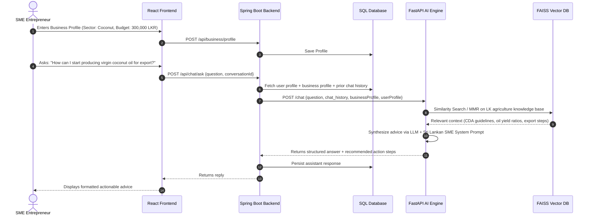
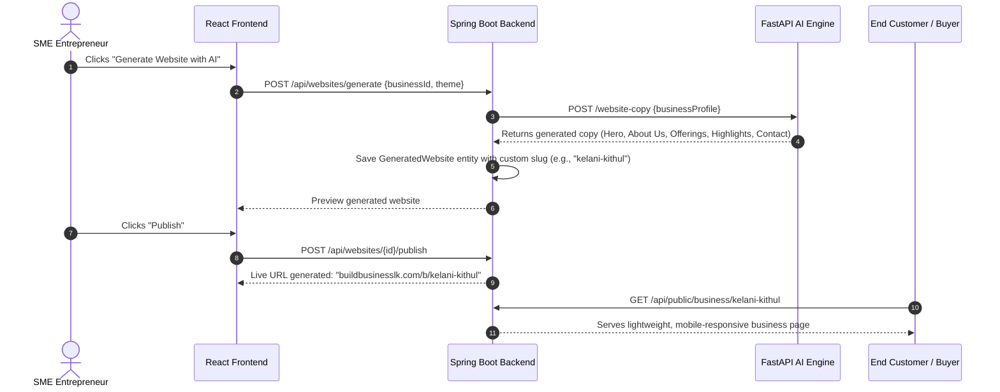
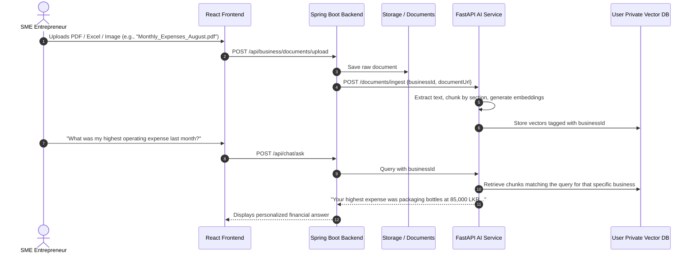

# BuildBusinessLK — Project Context Pack

> **How to use this document:** Paste this whole file into any AI assistant (Claude, ChatGPT, Gemini, etc.) as project context before asking questions about developing, debugging, expanding, or presenting **BuildBusinessLK**. If you only need a one-paragraph intro, use the TL;DR in Section 0.

---

## 0. TL;DR (short version for quick prompts)

BuildBusinessLK is an AI-powered enterprise enablement platform for rural Sri Lankan MSMEs. The platform currently supports **three agro sectors only — coconut, kithul, and palmyrah (thal)** — which the RAG knowledge base and ML recommender are built around. It is a decoupled monorepo: a **React** frontend, a **Spring Boot** REST API gateway, and a **FastAPI** AI microservice (LangChain, FAISS, Sentence-Transformers, Scikit-Learn). Core capabilities: an AI business mentor grounded in Sri Lankan agro-industrial knowledge, 1-click website generation and public hosting, email campaign management, social media ad copy generation, and (planned) ongoing personalized guidance via private document ingestion.

---

## 1. Introduction & Background

### 1.1 Project Overview
BuildBusinessLK is an AI-powered enterprise enablement platform tailored specifically for **Sri Lankan Micro, Small, and Medium Enterprises (MSMEs / SMEs)**, serving rural, semi-urban, and agro-based entrepreneurs.

**Supported sectors (current scope):** the platform supports **coconut, kithul, and palmyrah (thal)** only. All domain knowledge, feasibility scoring, and product-line recommendations are grounded in these three value chains. Other sectors (spices, handicrafts, small manufacturing) are out of scope for now and are candidates for future expansion.

### 1.2 Problem Statement
Rural entrepreneurs across Sri Lanka face systemic barriers that cause viable ventures to stay local or shut down:

- **Lack of digital literacy and business acumen** — most rural founders have no exposure to modern digital tools, online branding, or digital marketing.
- **Geographical isolation and middlemen exploitation** — without digital channels, sellers are locked inside regional borders and forced to sell produce to intermediaries at rock-bottom prices.
- **Competition from conglomerates** — large corporate brands dominate ad space, supermarket supply chains, and online distribution.
- **No ongoing mentorship** — consulting firms and marketing agencies are financially inaccessible to micro-entrepreneurs, so owners lack actionable advice when challenges arise.

### 1.3 Mission & Solution
BuildBusinessLK acts as a **24/7 autonomous digital co-founder**, delivering:

1. **Zero-barrier digital presence** — 1-click AI-generated hosted business websites, no coding required.
2. **Accessible multi-channel marketing** — AI copy and campaign management for email, public web, and social media.
3. **Domain-aware AI advisory** — real-time business advice grounded in Sri Lankan agro-industrial knowledge, legal compliance, and market pricing.
4. **Continuous personalized guidance (roadmap)** — ingestion of the business's own records, receipts, and catalogs for tailored operational steering.

---

## 2. Module-Wise Breakdown

```
┌─────────────────────────────────────────────────────────────────────────────┐
│                              BuildBusinessLK                                │
├───────────────────┬───────────────────────────┬─────────────────────────────┤
│   AI & Advisory   │      Marketing Suite      │     Business Operations     │
├───────────────────┼───────────────────────────┼─────────────────────────────┤
│ • RAG Q&A Engine  │ • Website Builder & Host  │ • Business & User Profiles  │
│ • ML Predictor    │ • Email Campaign Manager  │ • Customer Contact CRM      │
│ • Continuous RAG* │ • Social Media Ad Studio* │ • Multi-Language UI (EN/SI) │
└───────────────────┴───────────────────────────┴─────────────────────────────┘
  * In active development / roadmap
```

### Module 1 — AI Assistant & Business Advisor
- **Domain-specific RAG engine:** LangChain + FAISS vector search, pre-indexed with Sri Lankan agro-industrial datasets for the three supported sectors — Coconut Development Authority, Kithul Development Board, and Palmyrah Development Board — plus Export Development Board guidance and local market standards.
- **ML business & feasibility recommender:** `ml/predict.py` + `feasibility.py` evaluate capital budget (LKR), monthly raw yield (kg), staff size, and experience to recommend viable product lines within coconut, kithul, or palmyrah with feasibility scores (Capital Fit, Yield Fit, Staffing Fit).
- **Adaptive SME conversational agent:** reads the user's business profile and chat history, avoids generic academic answers, and returns concrete pros/cons, step-by-step local guidance, and Sinhala/English conversational support.

### Module 2 — Automated Website Builder & Public Hosting
- **AI website generation:** produces hero banners, value propositions, product showcases, founder story, and contact CTAs from the entrepreneur's registered profile.
- **Zero-code publishing:** live public presence under a clean slug (`/biz/:slug` or `/b/:slug`), with mobile responsiveness, SEO tags, and direct WhatsApp / phone contact integration.
- **Template customizer:** non-technical owners can edit generated content, toggle sections, and re-publish instantly.

### Module 3 — Email Marketing & Campaign Manager
- **Customer list management (CRM):** store contacts, organize recipient groups, or seed sample lists for instant testing.
- **AI email content generator:** promotional, seasonal, restock, or relationship-building copy matched to business tone and key offers.
- **Campaign dispatcher:** delivers formatted emails to customer segments and logs delivery statistics.

### Module 4 — Social Media Ads Studio *(under completion)*
- **Multi-platform ad generation:** creatives, headlines, hooks, body copy, and hashtags for Facebook, Instagram, Google Ads, and TikTok.
- **Budget & audience strategy:** localized targeting keywords (districts, age brackets, buyer interests) and tone variations (urgent, friendly, professional, cultural).

### Module 5 — Continuous Guidance & File Ingestion *(next milestone)*
- **Personalized file ingestion:** upload receipts, cost sheets, pricing lists, harvest logs, or PDF catalogs.
- **Dynamic business memory:** uploaded documents become a business-specific private vector collection, so the AI can answer questions such as *"Based on last month's production sheet, why were my raw material costs higher than normal?"* or *"Write an email to my wholesale buyers about our new harvest pricing."*

---

## 3. Repo Architecture & Tech Stack

Decoupled multi-service monorepo:

```text
BuildBusinessLK/
├── frontend/               # React Single Page Application (Web Portal)
├── backend/backend/        # Spring Boot Core REST API Gateway
├── ai-service/             # FastAPI Machine Learning & RAG Engine
├── website-templates/      # Reusable HTML/CSS/JS themes for SME hosted sites
└── documents/              # Project specs, academic reports, and API keys
```

### 3.1 Frontend (`frontend/`)
**Stack:** React (Create React App), React Router v6, Lucide Icons, Axios, TailwindCSS / custom theme CSS.

Responsibilities: clean, accessible UI designed for low digital-literacy users.

Key pages:
| File | Purpose |
| :--- | :--- |
| `AIChatPage.js` | Chat interface with formatted Markdown/rich advice rendering |
| `WebsiteMarketingPage.js` | Live website preview, copy editing, 1-click publishing |
| `HostedSmeBusinessPage.js` | Public-facing mobile-first website for end consumers |
| `EmailPage.js` | Contact list CRM, campaign creation, AI email generator |
| `AdsGenerationPage.js` | Ad studio for social media copy generation |
| `BusinessProfilePage.js` | Business metrics (budget, yield, sector, location, phone) |

**Localization:** English with Sinhala translation dictionaries (`translations/`).

### 3.2 Backend Gateway (`backend/backend/`)
**Stack:** Java 17+, Spring Boot 3.x, Spring Security (JWT + OAuth2 Google login), Spring Data JPA, Hibernate, PostgreSQL / MySQL / H2.

Responsibilities:
- Authentication, authorization, multi-tenant security isolation.
- Storing business metadata, chat sessions, customer contacts, email campaign history.
- Orchestration: receives client requests, enriches them with DB business context, calls `ai-service`, persists results.

Key controllers:
| Controller | Purpose |
| :--- | :--- |
| `AiController.java`, `ChatController.java` | Relay chat prompts and profile state to `ai-service` |
| `WebsiteController.java`, `PublicBusinessController.java` | Generate, persist, and serve public SME websites |
| `EmailCampaignController.java`, `EmailController.java` | Email pipelines and subscriber lists |
| `BusinessController.java`, `UserProfileController.java` | SME profiles, products, social links |
| `AdsController.java` | Relay ad generation queries to the AI service |

### 3.3 AI Service (`ai-service/`)
**Stack:** Python 3.10+, FastAPI, Uvicorn, LangChain, FAISS, Sentence-Transformers (`all-MiniLM-L6-v2`), an LLM abstraction layer over Ollama / Groq / OpenAI (`llm_factory.py`), Scikit-Learn.

Responsibilities:
- **RAG engine (`rag/`):** indexes local text files (`data/coconut.txt`, `data/kithul.txt`, `data/official_sources_lk_institutions.txt`) into a vector store.
- **ML recommender (`ml/`):** evaluates capital, yield, and workforce to output ranked business product recommendations.

Generative endpoints (`app.py`):
| Endpoint | Purpose |
| :--- | :--- |
| `POST /chat` | RAG Q&A + business-aware advisory |
| `POST /recommend-business`, `POST /business-advisor` | ML + feasibility logic |
| `POST /website-copy` | Auto-generates structured website copy |
| `POST /email-generate` | Generates personalized email campaigns |
| `POST /ad-generate` | Generates social media ad copy |

### 3.4 Website Templates (`website-templates/`)
**Stack:** static modern HTML5, CSS3, responsive JavaScript templates.
Provides base layouts (`modern-business-template`) dynamically populated by the backend using AI-generated website copy.

---

## 4. End-to-End Flows

### Flow 1 — Onboarding & AI Advisory Chat


### Flow 2 — 1-Click Website Generation & Public Access


### Flow 3 — AI Marketing Campaign (Email & Ads)
1. **SME action:** user opens the Marketing hub and selects Email or Social Media Ads.
2. **Parameters:** user provides a goal (e.g. "Avurudu New Year Sale", "New Batch Discount") and a target audience.
3. **AI generation:** backend forwards to `ai-service`, which creates —
   - *Email:* subject line, personalized opening, body text, CTA button text, sign-off.
   - *Ads:* primary text, alternative headlines, hook, recommended platform (Meta/Google), hashtag recommendations.
4. **Execution:**
   - *Emails* dispatched through the platform's campaign dispatcher to saved customer lists.
   - *Ads* saved and exportable into Meta Ads Manager or Google Ads.

### Flow 4 — Continuous Business File Ingestion *(planned)*


---

## 5. Implementation Status & Roadmap

| Feature Area | Status | Notes |
| :--- | :---: | :--- |
| User & Business Profile Management | ✅ Completed | Captures capital, location, sector, yield, employee count, social channels |
| RAG Knowledge Base (LK agro focus) | ✅ Completed | Scoped to the three supported sectors — coconut, kithul, palmyrah — plus export regulatory bodies |
| ML Business Recommender | ✅ Completed | Feasibility scoring based on budget and resource constraints |
| AI Advisor Chat Engine | ✅ Completed | Q&A integrated with chat history and business profile context |
| Automated Website Builder & Host | ✅ Completed | Copy generation, preview, custom slug routing, public view |
| Email Campaign Manager | ✅ Completed | Contact management, AI copywriting, campaign dispatch |
| Social Media Ads Studio | 🟡 In Progress | Prompt and copy generation done; finalizing platform-specific export formats |
| Continuous Document Guidance | 🔄 Planned | Ingestion pipeline (PDF/Excel), user-isolated vector namespaces, invoice memory |
| Bilingual Sinhala/Tamil Speech-to-Text | 🔮 Roadmap | Voice-first interaction for entrepreneurs with minimal typing literacy |
| Additional Sector Coverage | 🔮 Roadmap | Beyond coconut / kithul / palmyrah — requires new knowledge-base corpora and retrained feasibility data |

---

## 6. Ready-to-Paste Prompt Header

> *"BuildBusinessLK is an enterprise enablement platform for rural Sri Lankan SMEs. It currently supports three agro sectors only: coconut, kithul, and palmyrah (thal). It features a Spring Boot API gateway, a FastAPI AI microservice (LangChain, FAISS, ML feasibility models), and a React frontend. The primary capabilities are an AI business mentor, 1-click website generation and hosting, email marketing, social media ad generation, and ongoing personalized guidance via private document ingestion. Answer my questions with this architecture and sector scope in mind — do not assume support for sectors outside coconut, kithul, and palmyrah."*
