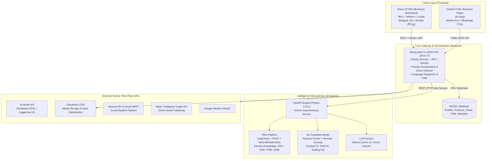
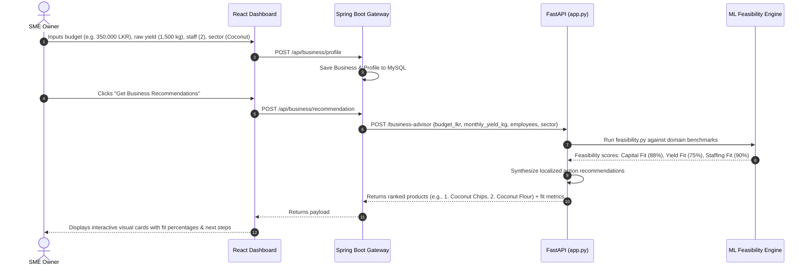
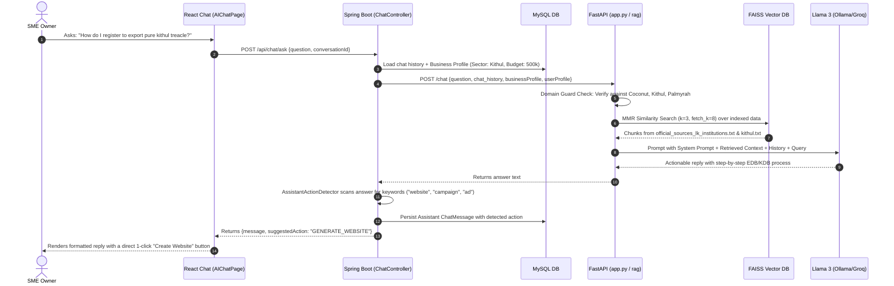
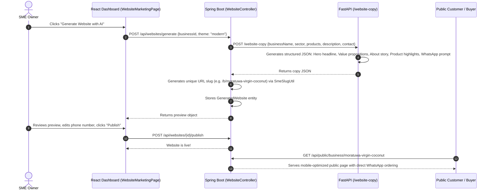

# BuildBusinessLK — Comprehensive Project Report

**Project Title:** AI-Driven Business Growth Assistant for MSMEs  
**Academic Affiliation:** University of Kelaniya — Faculty of Computing and Technology  
**Course & Group:** CSCI 23072 Group Project (Group 07)  
**Target Beneficiaries:** Rural & Semi-Urban Sri Lankan Micro, Small, and Medium Enterprises (MSMEs) in traditional agro-industrial value chains.  
**Supported Sector Scope:** Exclusively **Coconut (*Pol*)**, **Kithul**, and **Palmyrah (*Thal*)**.

---

## 1. Executive Summary & Problem Statement

### 1.1 The Rural Sri Lankan MSME Dilemma
In Sri Lanka, micro and small enterprises form over 75% of the total enterprise base and drive rural employment. Within the indigenous agro-processing sectors of **Coconut**, **Kithul**, and **Palmyrah**, rural producers craft high-value artisanal products (virgin coconut oil, pure kithul treacle, jaggery/hakuru, palmyrah flour, pinattu, and fiber crafts). However, these entrepreneurs encounter systemic barriers that stifle their growth:

1. **Digital & English Language Deficits:** Most rural producers have never used modern web platforms, content management systems (WordPress/Shopify), or complex advertising dashboards (Meta Ads Manager). English-only interfaces create an immediate barrier to entry.
2. **Information Asymmetry & Middlemen Exploitation:** Lacking direct market visibility, wholesale price benchmarks, and awareness of regulatory bodies, farmers and small processors sell yields to local intermediaries (*mudalalis*) at below-market rates.
3. **Barriers to Digital Storefronts:** Setting up an e-commerce website requires coding knowledge, domain registration, hosting, and graphic design that rural entrepreneurs cannot afford.
4. **Absence of Accessible Advisory:** Traditional business consulting or digital marketing agencies are financially out of reach, leaving owners with no guidance when dealing with harvest gluts, price drops, or export certifications (CDA, PDB, EDB).

### 1.2 The BuildBusinessLK Solution
**BuildBusinessLK** serves as a **24/7 Autonomous Digital Co-Founder** that democratizes digital transformation for non-technical rural entrepreneurs. It combines domain-grounded generative AI, machine learning feasibility models, zero-code digital marketing pipelines, and 1-click website generation within a bilingual (English / Sinhala) interface.

---

## 2. Multi-Repo Architecture & Technology Stack

The project is structured as a decoupled, multi-service monorepo:

### Module Responsibilities

| Component / Repo | Technology Stack | Key Responsibilities |
| :--- | :--- | :--- |
| **`frontend/`** | React 18, React Router v6, Material-UI (MUI), Tailwind CSS, Lucide Icons, Axios | Owner Dashboard, bilingual UI (Sinhala & English), multi-session AI chat with rich formatting, 1-click website customizer, CRM customer manager, social ad studio. |
| **`backend/backend/`** | Java 17, Spring Boot 3.x, Spring Data JPA, Hibernate, Spring Security (JWT & Google OAuth2) | Main business logic, auth/authorization, tenant isolation, public SME landing page hosting, prompt construction, email dispatch orchestration, action detection. |
| **`ai-service/`** | Python 3.10+, FastAPI, LangChain, FAISS Vector Store, HuggingFace (`all-MiniLM-L6-v2`) / FastEmbed, Scikit-Learn | RAG knowledge retrieval, ML feasibility scoring, copy generation for websites, email campaigns, and multi-platform social advertisements. |
| **`website-templates/`** | HTML5, Modern CSS3, Vanilla JS, Responsive Grid | Pre-designed, responsive, lightweight business templates used by the backend to render public storefronts. |
| **Database** | MySQL (with Hibernate automatic DDL schema updates) | Relational persistence of users, business profiles, products, chat history, websites, documents, and campaigns. |

---

## 3. Database Architecture & JPA Entity Models

The MySQL database schema is structured around Spring Data JPA entities in `com.backend.entity`:

1. **`User` & `UserProfile`**: Manages credentials, roles (`ROLE_USER`, `ROLE_ADMIN`), Google OAuth sub-IDs, contact details, preferred language, and avatar URL.
2. **`Business` & `BusinessProfile`**: Stores SME metadata:
   - Sector (`COCONUT`, `KITHUL`, `PALMYRAH`)
   - Capital budget in LKR
   - Monthly raw yield (in kg or nut count)
   - Staff count and operational experience
   - Target markets, registered business address, and phone numbers
3. **`BusinessProduct`**: Individual product listings tied to a business (e.g., "500ml Virgin Coconut Oil", "Pure Kithul Treacle Grade A"), prices, unit types, and Cloudinary image URLs.
4. **`BusinessSocialLink` & `ConnectedSocialAccount`**: Social platform handles (Facebook, Instagram, WhatsApp, TikTok) and OAuth tokens for Instagram Graph API publishing.
5. **`ChatSession` & `ChatMessage`**: Persistent conversational memory. Each chat session retains sender tags (`USER` / `ASSISTANT`), timestamps, context tokens, and detected action triggers.
6. **`GeneratedWebsite`**: Stores AI-generated website layouts, custom subpath slugs (e.g., `/b/hiru-kithul`), banner copy, about sections, featured products, publishing status (`DRAFT`, `PUBLISHED`), and custom CSS/theme settings.
7. **`EmailCampaign`, `EmailRecipient`, `RecipientGroup`, & `EmailCampaignRecipient`**:
   - Manages recipient lists and segmented customer groups (e.g., "Local Retailers", "Wholesale Buyers", "Export Inquiries").
   - Tracks individual delivery states (`PENDING`, `SENT`, `FAILED`, `SIMULATED`).
8. **`BusinessDocument`**: Uploaded financial sheets, invoice receipts, harvest logs, and PDF catalogs, with category classifications (`FINANCIAL`, `LEGAL`, `PRODUCTION`, `HARVEST`).
9. **`KnowledgeSource`**: Metadata catalog of institutional knowledge documents (CDA directives, EDB exporter directories, PDB technical specs) indexed in the RAG vector store.

---

## 4. External Integrations & Cloud Services

1. **AI Model Providers (`llm_factory.py`):** Multi-backend support for **Ollama (Llama 3)** (local/zero-cost), **Groq** (ultra-fast cloud inference), and **OpenAI GPT** via a unified LangChain provider interface.
2. **AI Horde (`AiHordeService.java`):** Connects to a distributed community cluster running Stable Diffusion XL / Juggernaut XL to generate professional ad graphics without requiring local GPU infrastructure.
3. **Cloudinary CDN (`CloudinaryStorageService.java`):** Hosts uploaded business assets, product photos, and generated marketing visuals, delivering optimized images to public visitors.
4. **Resend API & Gmail SMTP:** Production-grade email dispatch for targeted campaigns with automated fallbacks to Gmail SMTP for development.
5. **Meta / Instagram Graph API (`InstagramService.java`):** Authenticates and publishes generated social ad creatives and captions directly to connected Instagram business accounts.
6. **Export Development Board (EDB) Seed Data:** Bundled directory of verified Sri Lankan exporters (`EdbRecipientImporterService.java`), enabling rural producers to immediately reach potential wholesale buyers.

---

## 5. End-to-End Workflows

### 5.1 Onboarding, Profile Setup & Feasibility Recommendation

### 5.2 Conversational AI Business Advisory & RAG Query Pipeline

### 5.3 Automated 1-Click Website Generation & Public Storefront Hosting

### 5.4 Automated Marketing Campaign Engine (Email & Social Ads)
1. **Email Marketing (`EmailPage.js` & `EmailCampaignController.java`):**
   - The user selects a campaign goal (*Seasonal Sale*, *New Product Launch*, *Avurudu Special*, *Restock Announcement*).
   - `ai-service/app.py` generates high-converting subject lines, preheaders, personalized body text, and call-to-actions.
   - The owner can target segmented recipient groups or seed with registered Sri Lankan exporter contacts imported from the **Export Development Board (EDB)** directory (`EdbRecipientImporterService.java`).
   - Delivery executes through **Resend API** (or Gmail SMTP fallback) with simulated analytics logging.
2. **Social Media Ads Studio (`AdsGenerationPage.js` & `AdsController.java`):**
   - Generates platform-tuned copy for **Facebook**, **Instagram**, **WhatsApp Statuses**, and **TikTok**.
   - Outputs: Catchy hooks, primary ad text, short benefit bullets, local hashtags (`#SriLankanKithul`, `#OrganicCoconutLK`), and audience targeting parameters (age, districts like Kurunegala, Jaffna, or Colombo).
   - Generates matching ad visuals via **AI Horde** (`AiHordeService.java`), utilizing distributed Stable Diffusion XL models without requiring client-side GPU hardware.
   - Posts directly to Instagram via Meta Graph API integrations (`InstagramService.java`).

---

## 6. Subfeatures Breakdown Across Modules

### Module A: AI Advisor & Sector Knowledge Base
- **MMR (Maximal Marginal Relevance) Retrieval:** Minimizes duplicate documents and retrieves diverse institutional information from official bodies (CDA, PDB, EDB, KDB).
- **Strict Domain Guard:** Protects rural users from misleading AI hallucinations by restricting advice to Coconut, Kithul, and Palmyrah, rejecting out-of-scope industries (e.g., rubber, gems, tea, apparel) with friendly guidance.
- **Context Injection:** Every AI conversation automatically injects the entrepreneur’s specific capital, production yield, location, and staff count so advice is tailored rather than generic.
- **Interactive Action Buttons:** If the AI mentions creating a website or running an ad, the UI automatically mounts an interactive action button (e.g., *"Create Your Website Now"*) directly beneath the message bubble.

### Module B: ML Business Feasibility Recommender
- **3-Pillar Constraint Checking:**
  1. *Capital Fit:* Compares budget against real-world Sri Lankan machinery, packaging, and raw material costs.
  2. *Yield Fit:* Determines if monthly raw coconut count or sap volume in liters meets factory break-even volume.
  3. *Staffing Fit:* Validates labor requirements for manual tasks (e.g., jaggery boiling, tree tapping, copra drying).
- **Ranked Opportunity Scoring:** Outputs confidence-ranked business models (e.g., Kithul Treacle vs. Kithul Jaggery vs. Kithul Flour).

### Module C: Website Builder & Public Storefront
- **Zero-Code Assembly:** Synthesizes business profiles into Hero, About Us, Featured Offerings, Founder Story, and Contact cards.
- **Auto-Generated Clean Slugs:** Creates SEO-friendly, unique URLs (`/b/<business-name>`).
- **Direct WhatsApp Commerce Integration:** Converts online visitors directly into chat-based sales by pre-populating WhatsApp messages (e.g., *"Hello, I am interested in purchasing your 500ml Virgin Coconut Oil listed on BuildBusinessLK"*).
- **Click & View Analytics:** Tracks customer views and button clicks without third-party tracking cookies.

### Module D: Multi-Channel Marketing Suite
- **EDB Exporter Importer:** Pre-seeds database with authentic exporter contact information from the Sri Lanka Export Development Board to help rural producers find direct export buyers.
- **AI Copy Optimization:** Adapts writing tone across Professional, Friendly, Urgent, and Cultural tones.
- **AI Visual Generation:** AI Horde generates high-resolution product imagery based on business descriptions.
- **Direct Social Integration:** One-click publishing to connected Instagram Business accounts via the Meta Graph API.

### Module E: Business Document Memory (Continuous Guidance)
- **Document Ingestion:** Uploads PDFs, expense logs, and harvest receipts to `/uploads/business-documents/` and Cloudinary.
- **Private Vector Store:** Ingests internal records into isolated namespaces, enabling the AI to answer operational questions (e.g., *"Why did my bottling cost increase in July?"*).

---

## 7. Non-Functional Requirements Tailored for Rural Sri Lankan MSMEs

| Non-Functional Requirement | Challenge for Rural MSMEs | How BuildBusinessLK Solves It in Code & Architecture |
| :--- | :--- | :--- |
| **Low Digital Literacy** | Rural producers struggle with complex admin menus, configurations, DNS settings, and nested forms. | • **1-Click Generation:** Websites and ad campaigns are created with a single button click using saved profile data. • **Minimalist UI:** Large buttons, visual cards, and clear status badges powered by Material-UI. • **Smart Defaults:** Pre-configured budgets, yield calculations, and sample queries (`SUGGESTION_CATEGORIES` in `AIChatPage.js`). |
| **Language & English Barrier** | Most rural owners operate in Sinhala or Tamil and find English technical jargon intimidating. | • **Bilingual System:** Built-in language context (`LanguageContext.js`, `translations/index.js`) providing instant switching between English and Sinhala (සිංහල). • **Native Agro Vocabulary:** RAG prompts and system rules natively recognize Sri Lankan terms (*Pol*, *Kithul*, *Thal*, *Jaggery/Hakuru*, *Treacle/Pani*, *Pinattu*). • **Sinhala Chat Advisory:** The AI advisor processes prompts submitted in Sinhala or "Singlish" and replies in clear, structured Sinhala or plain English. |
| **Communication & Ordering Habits** | Rural Sri Lankans rarely transact through formal payment gateways (Stripe/PayPal) due to merchant account hurdles. | • **WhatsApp Commerce Integration:** The generated public storefronts feature direct "Order via WhatsApp" and "Call Owner" CTAs, matching Sri Lanka's dominant social commerce culture. |
| **Capital & Hardware Constraints** | MSMEs cannot afford high-end GPUs, cloud SaaS subscriptions, or expensive software licenses. | • **Open-Source & Free-Tier Architecture:** Built with Python, Spring Boot, MySQL, and Ollama/Llama 3. • **Distributed Image Generation:** Uses AI Horde for image generation, offloading compute to a distributed network at zero cost. |
| **Connectivity & Mobile-First Usage** | Rural factory and plantation owners access the internet primarily through low-bandwidth mobile smartphones. | • **Lightweight Public Pages:** Public business storefronts are built without heavy JavaScript frameworks to ensure rapid loading on 3G/4G connections. • **Responsive Dashboard:** All dashboard views (`MarketingPage`, `AIChatPage`, `BusinessProfilePage`) are fully responsive across mobile, tablet, and desktop screens. |
| **Actionable, Plain Advice** | Small business owners are discouraged by abstract theory or generic business advice. | • **Enforced Actionability Prompt:** System prompts explicitly instruct the AI: *"Avoid generic business-school advice. Do NOT tell the owner to 'conduct research' as a standalone task. Instead, share what you already know from the knowledge base, then give concrete next steps with Pros and Cons."* |
| **Security & Privacy** | Fear of intellectual property theft or customer contact leakage. | • **Tenant Isolation:** JWT-based stateless authentication ensures an owner's customer lists, sales records, and uploaded documents are strictly private and isolated. |

---

## 8. Summary

BuildBusinessLK bridges the digital divide for Sri Lanka's traditional agro-entrepreneurs by wrapping advanced AI engineering (RAG, ML feasibility scoring, distributed image generation, and multi-channel campaign dispatch) inside a simple, bilingual, mobile-first interface. By removing the need for coding skills, English fluency, or marketing expertise, it equips local businesses to transition from regional cottage setups into resilient, competitive enterprises.
